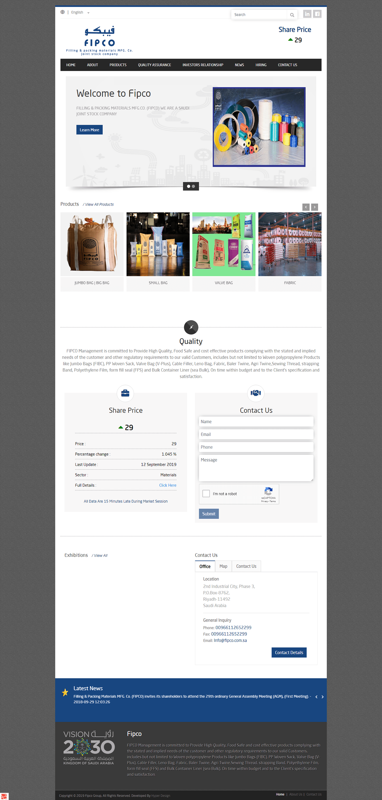

# Fipco

Filling and Packing Materials Manufacturing Co. (FIPCO) company is engaged in production of polypropylene bags with Coated and Un-coated low density polyethylene for heavy duty purposes and Cable filler, Valve Cement bags, Leno bags, Rachel bags, Strapping bands, Serving thread and marketing them inside and outside the Kingdom of Saudi Arabia.

Live Website preview
-----------
* (https://www.fillingandpacking.com/) 

 Key features: 
-----------

* Responsive website
* Using framework Bootstrap
* Using JQuery Plugins 

Screenshot
-----------

  

About me
-----------
 You can follow me at:
1. [Linkedin](https://www.linkedin.com/in/ahmed-alhoseny/)
2. [Behance](https://www.behance.net/ahmed-alhosany)
3. [Facebook](https://www.facebook.com/mido.hisham.777)

  

